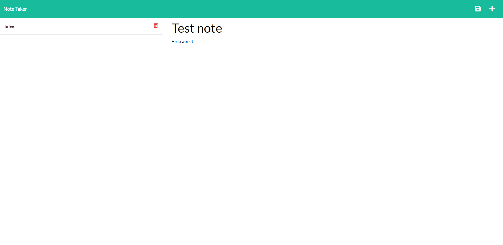

# note-taker 

## Description 
---
A note taking app that runs off of a Node.js server, and is deployed through Heroku. You can add and delete notes as you please, and you can see all of your saved notes displayed in a column.

https://boiling-temple-67606.herokuapp.com/

## Questions
---
https://github.com/lukehampton6

Contact me at lukehampton6@gmail.com